<div align="center">
  <a name="title"></a>
  <h3 align="center">QR Code Scanner App</h3>
  
  <p align="center">
    A qr code scanner mobile application.
  </p>
</div>

<details>
  <summary>Table of Contents</summary>
  <ol>
    <li>
      <a href="#about-the-project">About The Project</a>
      <ul>
        <li><a href="#tech-stack">Tech Stack</a></li>
      </ul>
    </li>
    <li>
      <a href="#getting-started">Getting Started</a>
      <ul>
        <li><a href="#prerequisites">Prerequisites</a></li>
        <li><a href="#installation">Installation</a></li>
      </ul>
    </li>
  </ol>
</details>

## About The Project

<p align="center">Shows a random user by value of the scanned qr code.</p>

### Demo

https://github.com/chsdwn/QRCodeScannerApp/assets/13810855/64123d90-e82d-4745-bcdd-a184bd10eb61

### Screenshots

#### QR Code

##### iOS

<div style="display: flex; flex-direction: row; justify-content: space-evenly;">
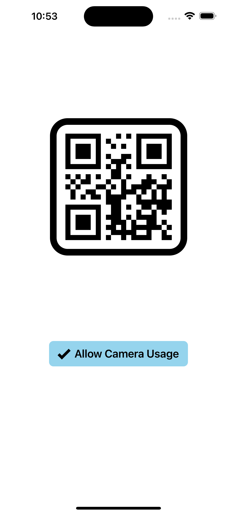
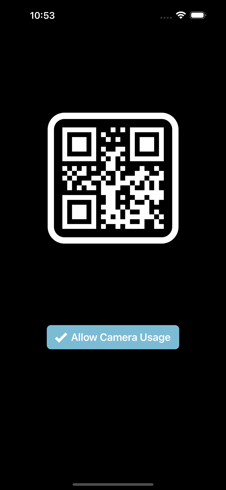
</div>
<br />

<div style="display: flex; flex-direction: row; justify-content: space-evenly;">
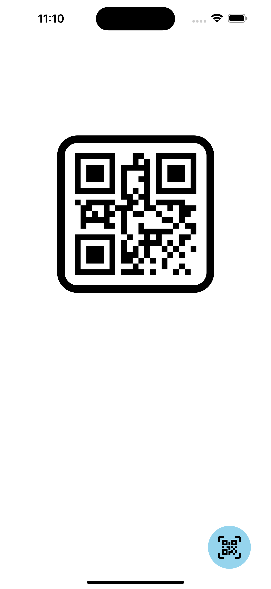

</div>
<br />

<div style="display: flex; flex-direction: row; justify-content: space-evenly;">
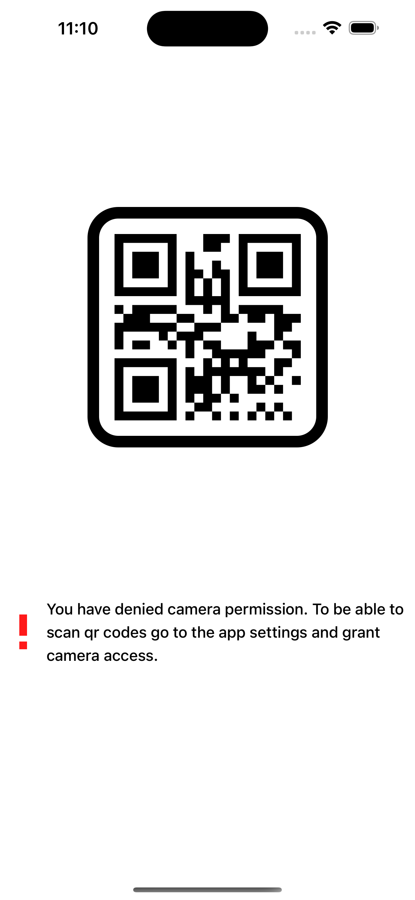
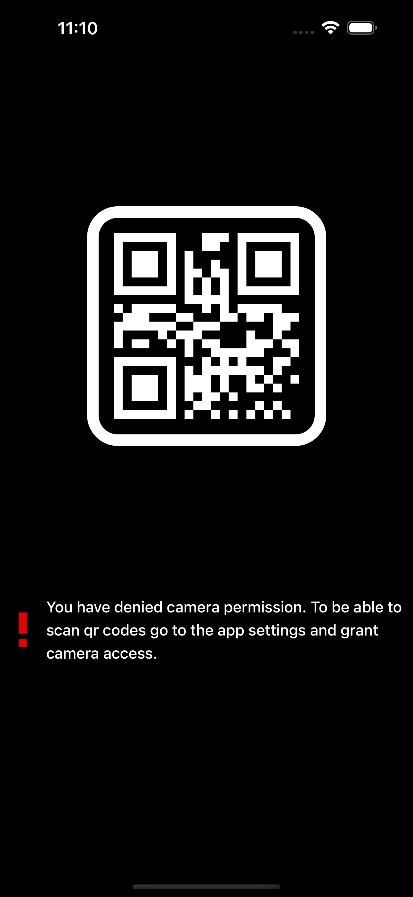
</div>

##### Android

<div style="display: flex; flex-direction: row; justify-content: space-evenly;">
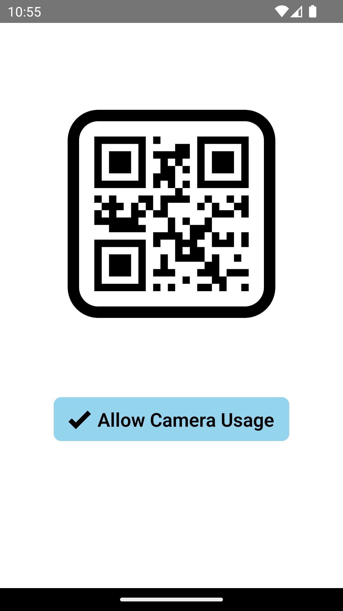
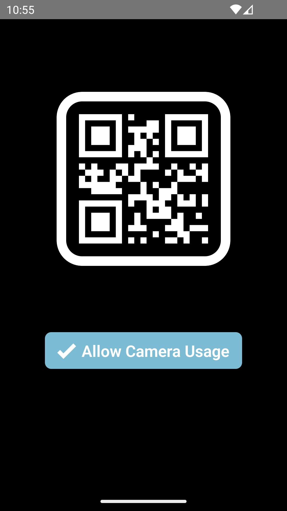
</div>
<br />

<div style="display: flex; flex-direction: row; justify-content: space-evenly;">
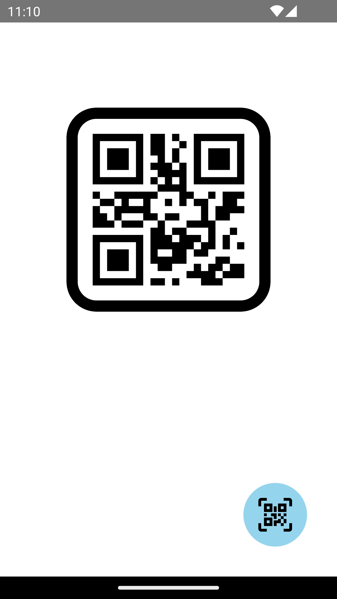
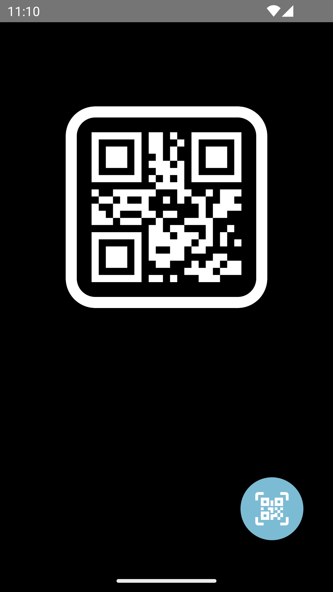
</div>
<br />

<div style="display: flex; flex-direction: row; justify-content: space-evenly;">
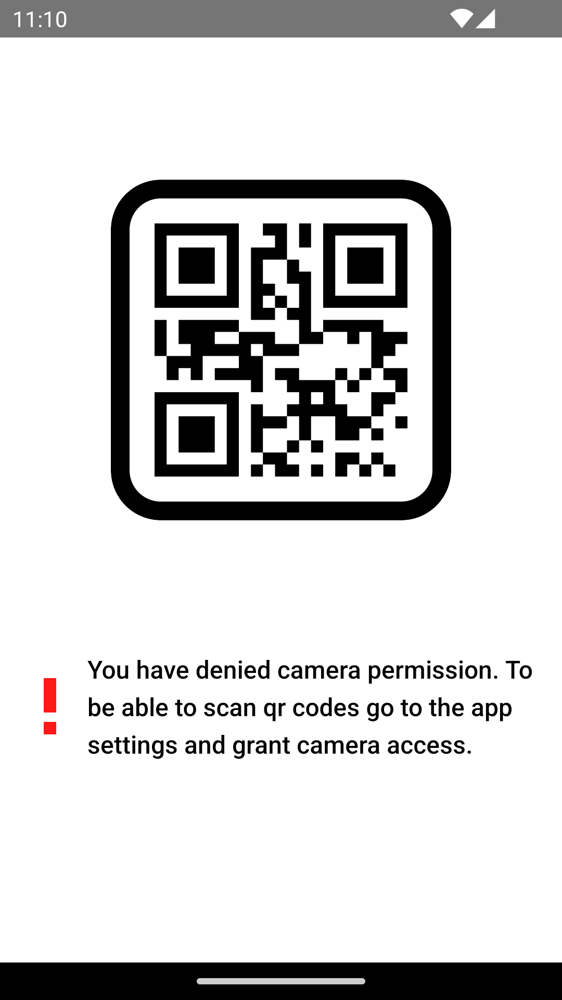
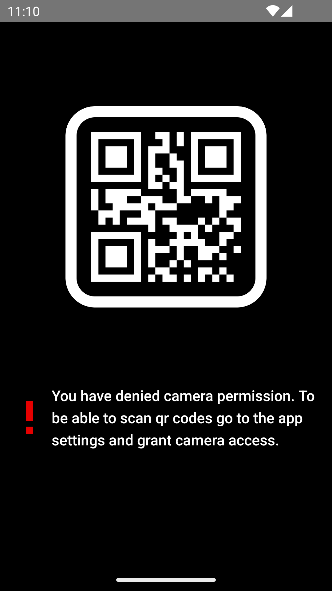
</div>

#### User Details

##### iOS

<div style="display: flex; flex-direction: row; justify-content: space-evenly;">
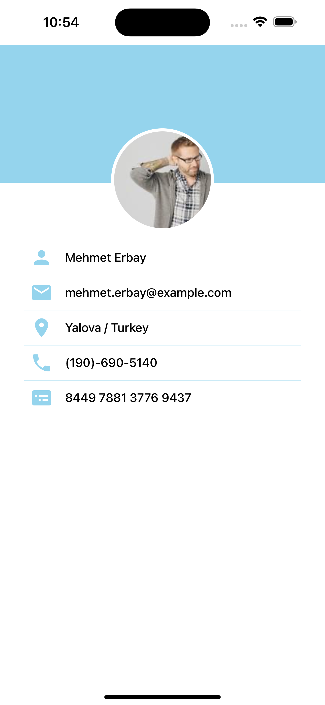
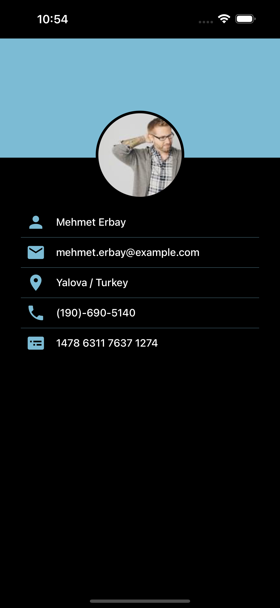
</div>

##### Android

<div style="display: flex; flex-direction: row; justify-content: space-evenly;">
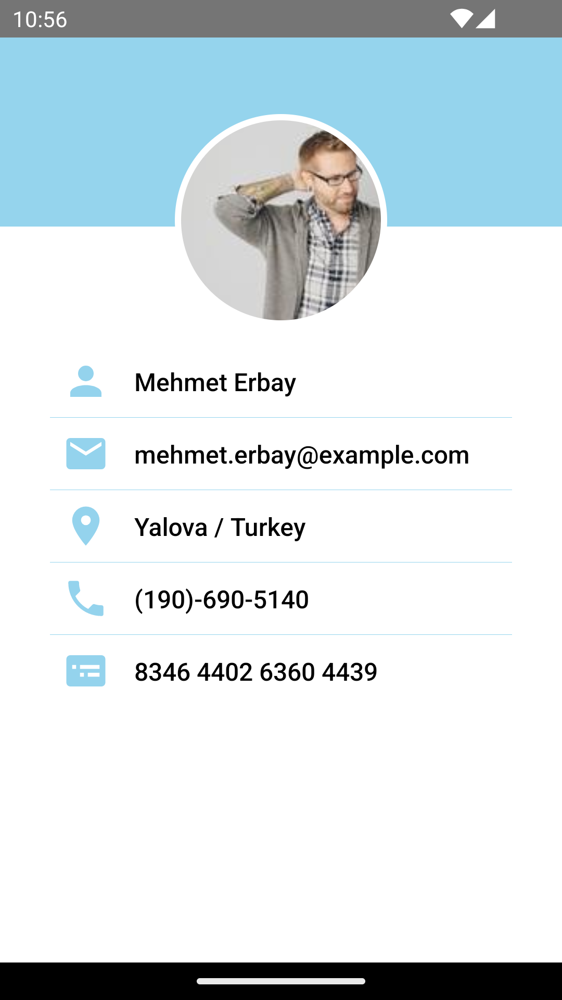
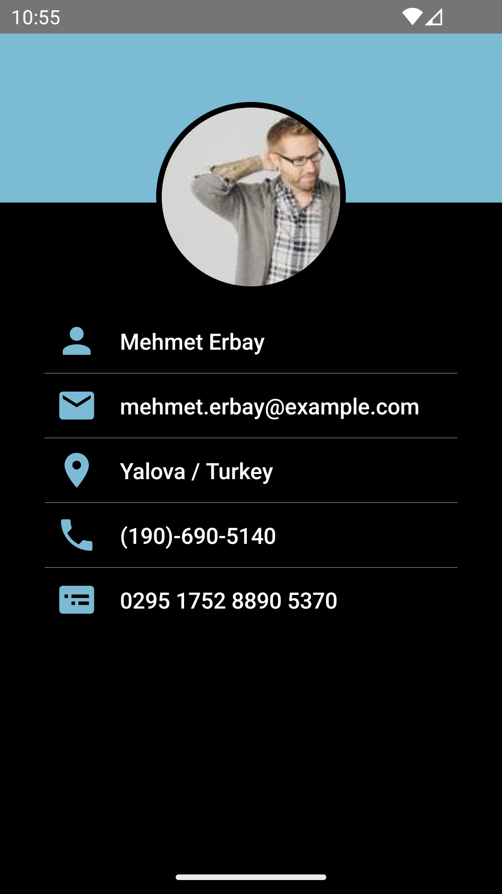
</div>


### Tech Stack

| Library                  | Category         | Version | Description                                                                    |
| ------------------------ | ---------------- | ------- | ------------------------------------------------------------------------------ |
| React Native             | Mobile Framework | v0.72   | The best cross-platform mobile framework                                       |
| React                    | UI Framework     | v18     | The most popular UI framework in the world                                     |
| TypeScript               | Language         | v4      | Static typechecking                                                            |
| React Navigation         | Navigation       | v6      | Performant and consistent navigation framework                                 |
| Expo Camera              | Camera           | v13     | A React component that renders a preview for the device's front or back camera |
| Expo Barcode Scanner     | Camera           | v12     | A library that allows scanning a variety of supported barcodes                 |
| React Native SVG         | UI               | v14     | SVG library for React Native                                                   |
| React Native QR Code SVG | UI               | v6      | A QR Code generator for React Native                                           |
| Hermes                   | JS engine        |         | Fine-tuned JS engine for RN                                                    |
| Jest                     | Test Runner      | v29     | Standard test runner for JS apps                                               |

<p align="right">(<a href="#title">back to top</a>)</p>

## Getting Started

### Prerequisites

- React Native Development Environment

  Please follow the guide to set up your development environment. https://reactnative.dev/docs/environment-setup?guide=native

- yarn
  ```sh
  npm i -g yarn
  ```

### Installation

1. Clone the repo
   ```sh
   git clone https://github.com/chsdwn/QRCodeScannerApp
   ```
1. Navigate to the QRCodeScannerApp directory
   ```sh
   cd QRCodeScannerApp
   ```
1. Install NPM packages
   ```sh
   yarn
   ```
1. (MacOS only) Install Cocoa packages
   ```sh
   npx pod-install
   ```
1. Start metro server
   ```js
   yarn start
   ```
1. Start application
   1. Android
      ```sh
      yarn android
      ```
   1. iOS
      ```sh
      yarn ios
      ```

<p align="right">(<a href="#title">back to top</a>)</p>
